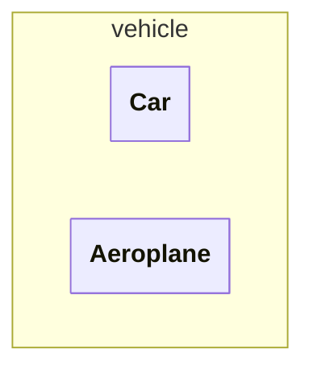
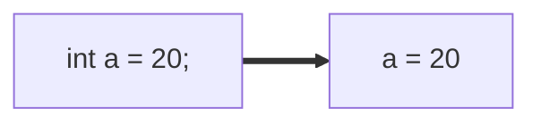
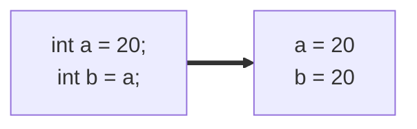
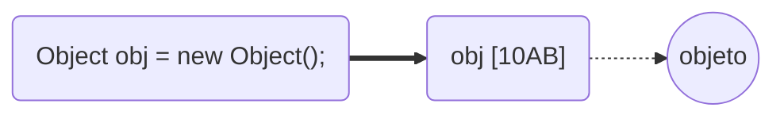
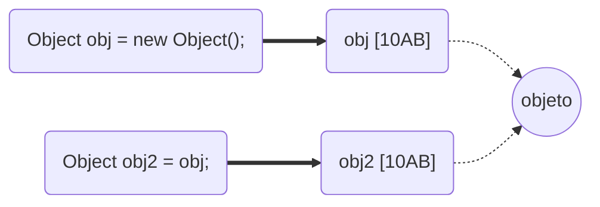
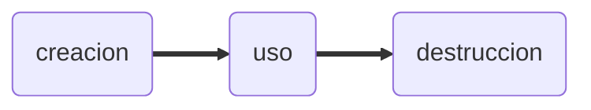

# JAVA - Curso práctico de formación (IZO-808)
Este archivo contiene notas sobre el libro **JAVA - Curso práctico de formación 
para la preparacion del examen de certificacion Java SE Programmer I: IZO-808**
del autor **Antonio Martín Sierra**, editorial **Alfaomega**, ISBN **978-607-538-267-8**

- [JAVA - Curso práctico de formación (IZO-808)](#java---curso-práctico-de-formación-izo-808)
  - [1. Fundamenrtos de JAVA.](#1-fundamenrtos-de-java)
    - [1.1 Principales características](#11-principales-características)
    - [1.2 Ciclo de vida de un programa](#12-ciclo-de-vida-de-un-programa)
    - [1.3 Estructura de una clase](#13-estructura-de-una-clase)
      - [1.3.1 Empaquetado de una clase](#131-empaquetado-de-una-clase)
      - [1.3.2 Importacion de clases](#132-importacion-de-clases)
    - [1.4 El metodo main](#14-el-metodo-main)
    - [1.5 Compilación y ejecución de programas Java](#15-compilación-y-ejecución-de-programas-java)
      - [1.5.1 Compilación](#151-compilación)
      - [1.5.2 Ejecución](#152-ejecución)
  - [2. Tipos de datos](#2-tipos-de-datos)
    - [2.1 Variables](#21-variables)
      - [2.1.1 Declaracion de una variable](#211-declaracion-de-una-variable)
      - [2.1.2 Ambito de una variable](#212-ambito-de-una-variable)
      - [2.1.3 Inicializacion por defecto](#213-inicializacion-por-defecto)
    - [2.2 Tipos de datos](#22-tipos-de-datos)
      - [2.2.1 Tipos primitivos](#221-tipos-primitivos)
        - [Literales](#literales)
        - [Conversion de tipos](#conversion-de-tipos)
      - [2.2.2 Tipos Objeto](#222-tipos-objeto)
        - [Ciclo de vida de los objetos](#ciclo-de-vida-de-los-objetos)
          - [Creacion](#creacion)
          - [Destruccion](#destruccion)
        - [Clases de envoltorio](#clases-de-envoltorio)
          - [Autoboxing/Unboxing](#autoboxingunboxing)
          - [Inmutabilidad de objetos envoltorio](#inmutabilidad-de-objetos-envoltorio)
  - [3. Operadores y estructuras de decision](#3-operadores-y-estructuras-de-decision)
    - [3.1 Operadores aritméticos](#31-operadores-aritméticos)
      - [3.1.1 Operadores simples.](#311-operadores-simples)
      - [3.1.2 Operadores de incremento y decremento](#312-operadores-de-incremento-y-decremento)
    - [3.2 Operadores de asignacion](#32-operadores-de-asignacion)
    - [3.3 Operadores condicionales](#33-operadores-condicionales)
      - [3.3.1 Igualdad de objetos](#331-igualdad-de-objetos)
        - [Pool de objetos.](#pool-de-objetos)
      - [3.3.2 Igualdad de cadenas de caracteres.](#332-igualdad-de-cadenas-de-caracteres)
        - [Igualdad de objetos StringBuilder.](#igualdad-de-objetos-stringbuilder)
      - [3.3.2 Igualdad de objetos de envoltorio.](#332-igualdad-de-objetos-de-envoltorio)
    - [3.4 Operadores logicos](#34-operadores-logicos)
    - [3.5 Otros operadores](#35-otros-operadores)
    - [3.6 Estructuras de decision](#36-estructuras-de-decision)
      - [3.6.1 Setencia If Else](#361-setencia-if-else)
      - [3.6.2 Setencia Switch](#362-setencia-switch)
  - [4. Arrays](#4-arrays)
    - [4.1 Declaracion](#41-declaracion)
    - [4.2 Instanciacion](#42-instanciacion)
    - [4.3 Acceso a datos de un array.](#43-acceso-a-datos-de-un-array)
    - [4.4 Arrays como parametros](#44-arrays-como-parametros)
    - [4.5 Arrays multidimensionales](#45-arrays-multidimensionales)
    - [4.6 Arrays irregulares](#46-arrays-irregulares)
  - [5. Instrucciones de repeticion](#5-instrucciones-de-repeticion)
    - [5.1 Instruccion For](#51-instruccion-for)
      - [5.1.1 For Each](#511-for-each)
    - [5.2 Instruccion While](#52-instruccion-while)
      - [5.2.1 Do While](#521-do-while)
    - [5.4 Instrucciones break y continue](#54-instrucciones-break-y-continue)
      - [5.4.1 Break](#541-break)
      - [5.4.2 Continue](#542-continue)
    - [5.3 Bucles etiquetados](#53-bucles-etiquetados)


## 1. Fundamenrtos de JAVA.
### 1.1 Principales características

- **Lenguaje orientado a objetos:** adquiere las caracteristicas de los lenguajes 
orientados a objetos (herencia, sobrecarga, sobrescritura, polimorfismo y encapsulacion)
- **Portabilidad:** gracias a la JVM, un programa en java puede compilarse una vez y 
ejecutarse en cualquier lugar, es decir, el resultado de la compilacion no es dependiente
a la plataforma
- **Encapsulamiento:** nos permite utilizar modificadores de acceso para controlar como 
desde donde se puede accesar a metodos y atributos.
- **Robusto y Seguro:** se ejecuta en un entorno controlado por la JVM. La cual gestiona 
de manera automatica la memoria evitando violaciones de acceso, e impide operaciones
dañinas sobre el equipo.

### 1.2 Ciclo de vida de un programa

Al ser un lenguaje orientado a objetos los programas en java se escriben en clases, estas 
clases se escriben en archivos .java (codigo fuente), al compilarlos se generá un archivo 
.class (bytecodes) por cada clase definida.
Los bytecodes son independientes de la plataforma, pueden ejecutarse en cualquier S.O. que
cuente con la JVM.


### 1.3 Estructura de una clase
El objetivo de una clase es definir el comportamiento de los objetos que la utilicen, es 
posible crear uno o muchos objetos a partir de una clase. El comportamiento de los 
objetos se implementa mediente atributos y metodos.
Podemos entender una clase como un molde, y a los objetos como instancias fisicas creadas
mediante este molde.

Una clase se define utilizando la palabra reservada `class` seguida de un nombre, y entre 
llaves el contenido de la clase.
Una clase puede contener:
- **atributos:** variables que almacenan propiedades de los objetos
- **constructores:** funciones para crear objetos de la clase
- **metodos:** funciones para implementar comportamientos del objeto

>[!NOTE]
>Un archivo .java puede varias clases, pero solo 1 debe utilizar
el modificador de acceso `public` y su nombre deve coincidir con el nombre del archivo .java

>[!CAUTION]
>Si un archivo .java contiene dos o mas clases con el modificador de acceso `public` se genera
un error de compilacion

Ejemplo de una clase
```java
public class Car{
    private String model;  //atributo
    
    public Car(){  //constructor

    }

    public void acelerar(){  //metodo

    }
}
```

Para crear objetos de una clase utilizamos la palabra `new`.
```java
Car car = new Car();
```

Para hacer uso de los metodos de una clase utilizamos el objeto y con operador punto (.)
podemos acceder a los metodos.
```java
car.acelerar();
```
---
#### 1.3.1 Empaquetado de una clase
Las clases se organizan en paquetes (directorios), cada paquete puede contener varios
archivos .class y subpaquetes.
El paquete se puede definir  utilizando la palabra `package <package-name>`, 
esta sentencia debe ir al princiipio del archivo .java, todas las clases definidas
en el archivo estaran en el mismo paquete

```java
package vehicle 

public class Car{

}

class Aeroplane{

}
```


---
#### 1.3.2 Importacion de clases
Para utilizar clases de otros paquete se deben importar dentro del archivo .java, para ello
utilizamos la sentencia `import`. Esta setencia debe ir despues de la setencia `package` y
antes de la definicion de la clase
Esta sentencia nos permite importar clases de las siguientes maneras:
- **Importar una clase:** `import java.util.ArrayList`
- **Importar todas las clases de un paquete:** `import java.util.*`
- **Importar atributos estaticos de una clase:** `import java.lang.Math.*`

---

>[!CAUTION]
>La sentencia `package` debe ser la primera del archivo .java, si se invierte el orden entre 
`package` e `import` se producira un error de compilacion

---

### 1.4 El metodo main
Un programa en Java puede estar conformado por muchas clases, entre todas ellas debe 
existir una que contenga el metodo main. Este metodo es el punto de entrada, es utilizado por la JVM cuando se ejecuta la clase.

El metodo main solo admite dos formatos
```java
public static void main(String[] args){
    ...
}

public static void main(String arg1, String arg2, ..., String argN){
    ...
}
```

>[!CAUTION]
>Si el metodo main tiene un formato incorrecto **no se provocara un error de compilacion**
ya que sintacticamente son correctos, sin emabrgo, al ejecutar la clase se producira un 
error de ejecucion ya que la JVM no encontrara el metodo main

### 1.5 Compilación y ejecución de programas Java
Para poder compilar y ejecutar programas Java es necesario contar con el JDK.
El JDK (Java Development Kit) proporciona herramientas para realizar estas tareas,
asi como clases que conforman el Java Standar Edition (Java SE).

Para descargar alguna version del JDK se puede hacer en el siguienete enlace:
[https://www.oracle.com/java/technologies/downloads/](https://www.oracle.com/java/technologies/downloads/)

#### 1.5.1 Compilación
Para compilar un archivo .java debemos ejecutar por linea de comandos el comando: 
`javac FileName.java`

Si las clases que utilizamos estan definidas en paqutes y queremos que se genere
la estructura de carpetas, debemos usar: `javac -d . FileName.java`

>[!IMPORTANT]
> Si el codigo fuente tiene errores de compilacion, estos se mostraran en consola

#### 1.5.2 Ejecución
La ejecucion consiste en ejecutar la clase que contiene el metodo main, para ello
utilizamos el comando `java ClassName`

Si la clase se encuentra dentro de un paquete, se debe utilizar el nombre cualificado
de la clase `java package.ClassName` 

>[!IMPORTANT]
>Al momento de ejecutar una clase se indica el nombre de la misma, no el archivo 
.class que la contine


## 2. Tipos de datos

### 2.1 Variables
En java, los datos se manejan mediante variables independientemente de su tipo.
Una variables es una seccion de memoria a la cual le asiganamos un identificador y en la
que se alamcenan los datos del programa.

#### 2.1.1 Declaracion de una variable
Declarar una variable consiste en definir el tipo e indentificador de la misma.
la sintaxis que debemos seguir es `tipo identificador;`, por ejemplo, `int edad;`.

>[!IMPORTANT]
>En Java es necesario declarar una variable antes de poder usarla.

Para asignar un valor a una variable podemos seguir la sintaxis `identificador = valor;`, 
siguiendo con el ejemplo anterior seria de la siguiente manera `edad = 18;`.

Existen otras maneras de declarar variables:
- **Declarar y asignar valor en una sola instruccion:** `int a = 1;`
- **Declarar multiples variables en una sola linea:** `int b, c, d=8;`

 >[!IMPORTANT]
>El identificador de una variable debe cumplir con las siguientes reglas:
> - Se permite cualquier combinacion de letras, números y los símbolos $ y _
> - No se permite utilizar palabras reservadad de Java
> - No puede comenzar con un carácter numerico.
>
> Si alguna de estas reglas no se cumple se generara un error de compilacion

#### 2.1.2 Ambito de una variable
El ambito de una variable se refiere a la visibilidad de la misma, esto esta determinado por
el lugar donde se declara. Tenemos dos tipos de ambitos:
- **Atributo:** declaracion a nivel de clase, son compartidad por todos los metodos
- **Local:** declaracion a nivel de metodo, solo es visible en el metodo que la declara

>[!NOTE]
>En Java una variable local puede tener el mismo nombre que una variable atributo, en este caso,
>para utilizar la variable atributo hacemos uso de `this`

>[!NOTE]
>Si una variable es declara dentro de bloque de codigo como un if, for, while o algun otro
>Solo sera visible dentro de ese bloque.

Ejemplos:
```java
public class TestClass{
    int x;

    public void testMethod(){
        int x = 10;  //variable local
        this.x = x + 3  //variable atributo
    }
}
```

```java
public class TestClass{
    int x;

    public void testMethod(){
        int x = 10;  
        if(x > 5){
            int y = 5; //solo es visible dentro del if
            this.x = x + y + 3;
        }
    }
}
```

#### 2.1.3 Inicializacion por defecto
La inicializacion por defecto depende del ambito de la variable.
- **variable local:** no se inicializan por defecto, por lo que no puede usarse sin asiganrle antes un valor explicito
- **variable atributo:** se inicializan por defecto al momento de declararse, el valor de inicializacion depende del tipo de la variable.
  
| Tipo    | Valor por defecto |
| ------- | ----------------- |
| entero  | 0                 |
| decimal | 0.0               |
| boolean | false             |
| char    | '\u0000'          |
| object  | null              |

### 2.2 Tipos de datos 
En Java existen dos grupos de tipos de datos **tipos primitivos** y **tipo objetos**. 
Estos tipos son tratados internamente de forma distinta.

#### 2.2.1 Tipos primitivos

Los tipos de datos primitivos representan a los tipos basicos del lenguaje. Al declarar y asignar 
valor a un tipo primitivo, internamente la variable almacena el datoen si.



Si en una siguiente instruccion asignamos esta variable a otra, se genera una copia del dato



Se cuenta con 8 tipos primitivos, los cuales se muestran en la siguiente tabla:

| Tipo    | Valores                   |
| ------- | ------------------------- |
| boolean | true o false              |
| byte    | entero de 8 bits          |
| short   | entero de 16 bits         |
| int     | entero de 32 bits         |
| long    | entero de 64 bits         |
| float   | decimal de 32 bits        |
| double  | decimal de 64 bits        |
| char    | codigo unicode de 16 bits |

##### Literales
A un dato especifico de un tipo primitivo se le conoce tambien como **literal**.
Los literales se pueden asignarse directamente a la variable del tipo que representan.

>[!NOTE]
>Los literales, segun el dato, se consideran de un tipo especifico
> - literal enteros, se consideran int `int n = 30`
> - literal decimal, se consideran double `double d = 3.6`
> - Para que un lteral decimal se considere float, se debe especificar con un f al final `float f = 3.6f`
> - literal char (entre comillas simples), se cosideran char `char c = '@'`
> - literal boolean, solo se consideran a los valores true o false `boolean b = true`

Los literales de tipo entero pueden ser representados en 4 sistemas de numeracion

- **decimal:** es el mas utilizado `int a = 250;`
- **octal:** se debe utilizar un 0 antes del numero `int o = 0432;`
- **hexadecimal:** se debe utilizar 0x antes del numero `int h = 0xef34;`
- **binario:** se debe usar 0b antes del numero `int b = 0b1001;`

Adicional, desde la version 7 de Java, es posible utilizar el simbolo "_" para 
representar literales numericas. Este simbolo facilita la interpretacion visual del programador
pero debe cumplir con las siguinetes restricciones:

- Debe aparecer entre digitos
- No se puede utilizar al principio o al final de la cifra
- No se puede utilizar junto al punto decimal

Algunos ejemplos de su uso son:
```java
int n = _345 //error
int s = 0x_B1 //error
int a = 1_000_000 //correcto
double b = 37.30_49 //correcto 
```

##### Conversion de tipos
Todos los datos primitivos pueden ser convertidos a otro tipo de dato, excepto los booleanos.
Las conversiones de datos pueden ser de dos tipos:

- **Implícitas:** Java convierte de forma automatica el dato origen al tipo de dato destino.
Es posible utilizar esta conversion siempre que el tipo de dato origen sea de menor o igual 
tamaño que el destino

>[!CAUTION]
>No se podra realizar una conversion implícita cuando:
> - El tipo origen sea numerico y el destino sea char
> - El tipo origen sea decimal y el destino sea entero


#### 2.2.2 Tipos Objeto
Cualquier clase Java es de tipo objeto, se utilizan mediente variables pero internamente se 
manejan de forma distinta. Cuando se crear una variable de tipo objeto, esta almacena una
referencia hacia la zona de memoria donde se encuentra el objeto.



Este tipo de manejo implica que si en algun momento una variable se asigna a otra, tendremos
dos variables con la misma referencia al objeto.



Los objetos no adminten las mismas operaciones que los tipos primitivos (aritmeticas, logicas, etc.).
En cambio existen metodos que pueden ser utilizados en el flujo del programa para realizar
alguna accion.
El uso de estos metodos se realiza mediante la varible, el operador punto y el nombre del metodo
```java
Car car = new Car();
car.turnOn();
```

##### Ciclo de vida de los objetos



###### Creacion
Para crear una instancia de una clase se utiliza el operador `new` seguido del nombre de la clase
Esta instruccion crea un objeto nuevo en memoria y devuelve una referencia a este objeto para
almacenarla en la variable.

```java
Object obj = new Object();
String s = new String("hola");
```

En esta etapa se utilizan los constructores de una clase, estos se ejecutan durante 
la creacion de un objeto. 
Los constructores se definen dentro de la clase como un metodo con el mismo nombre de la clase.

```java
public class TestClass{
  public TestClass(){
    ...
  }
}
```

El codigo definido en el constructor se ejecutara cada vez que se cree un objeto de la clase, el objetivo
de estos metodos es realizar alguna inicializacion de los atributos de la clase por lo que pueden
recibir parametros.
Una clase puede contener varios constructores, pero deben diferenciarse por el numero y/o tipos
de parametros que reciben

```java
public class TestClass{
  public TestClass(){
    ...
  }

  public TestClass(int i){
    ...
  }

  public TestClass(String s){
    ...
  }
}
```

###### Destruccion
La destruccion de un objeto y la liberacion de la memoria ocupada por el mismo es realizado
por un proceso del **Garbage Collector (GC)**.
Cuando este proceso se ejecute se liberara la memoria de todos los objetos que hayan sido marcados
para recoleccion.

>[!NOTE]
>Un objeto es marcado para recoleccion en el momento en que no hay ninguna variable apuntando a el.


```java

public static void main(String[] args){
  Object o1 = new Object();
  Object o2 = new Object();
  o1 = o2;  //el primer objeto es marcado para recoleccion
  o2 = null; //el segundo objeto es marcado para recoleccion
}

```

>[!NOTE]
>Cuando un objeto es marcado para recoleccion no hay forma de recuperarlo.

Todas las clases cuentan con un metodo `finalize()`, este metodo es usado por la JVM
justo antes de ser eliminado de memoria. `finalize()` puede ser llamado una vez o ninguna, pero
nunca mas de una vez

>[!NOTE]
>Puede darse el caso de que un objeto nunca sea eliminado, y esto puede deberse a que nunca
>sea marcado para recoleccion, o porque el Garbage Collector no se haya activado desde que 
>el objeto se marco para recoleccion.

##### Clases de envoltorio
El paquete `java.lang` cuenta con un grupo de clases que permiten datos primitivos
en objetos. Para cada tipo primitivo existe una clase envoltorio.

| Tipo    | Clase envoltorio |
| ------- | ---------------- |
| boolean | Boolean          |
| byte    | Byte             |
| short   | Short            |
| int     | Integer          |
| long    | Long             |
| float   | Float            |
| double  | Double           |
| char    | character        |

Todas estas clases disponen de un constructor que recibe como parametro el tipo primitivo
```java
Integer i = new Integer(40);
Character c = new Character('#');
```

A excepcion de Character, todas las clases cuentan con un constructor que recibe 
como parametro la representacion del tipo primitivo en forma de texto.
```java
Integer i = new Integer("79");
Boolean b =  new Boolean("false");
```

Adicionalmente, cada una de estas clases cuenta con un metodo para recuperar el 
valor primitivo. Este metodo sigue la nomeclatura `<primitive-type>Value()`
```java
char c2 = c.charValue();
int i2 = i.intValue();
```

###### Autoboxing/Unboxing
Desde Java 5, es posible crear objetos de las clases envoltorio asignando directamente
una literal (sin hacer uso de `new`), a esto se le conoce como **Autoboxing**
```java
Integer in = 89;
Boolean bo = false;
```

Tambien es posible recuperar el tipo primitivo asignando el objeto envoltorio a una 
variable de tipo primitivo, esto es conocido como 
```java
int inp = in;
boolean bop = bo
```

###### Inmutabilidad de objetos envoltorio
Los objetos de clases envoltorio son inmutables, es decir, no se pueden modificar
La forma en la que funcionan en una operacion es la siguiente.
```java
Integer a = 10;    
a = a + 2;
```
En la primera linea se utiliza autoboxing para crear el objeto envoltorio.
En la segunda linea, para poder realizar la operacion se realizan los siguientes pasos:
1. Se utiliza unboxing para obtener el primitivo de `a`
2. Se genera un nuevo objeto (autoboxing) utilizando el resultado de la operacion

>[!TIP]
>Debido a la inmutabilidad, es mas eficiiente utilizar variables primitivas si vamos
>a realizar operaciones aritmeticas, ya que el proceso de autoboxing/unboxing puede
>representar un mayor consto de rendiemiento.


## 3. Operadores y estructuras de decision

### 3.1 Operadores aritméticos
Permiten realizar operaciones aritméticas con los datos de tipo numérico, incluye
los tipos primitivos y las clases envoltorio.

Los operadores aritmético son +,-,*,/,%,++,--.

#### 3.1.1 Operadores simples.
Los operadores simples son suma (+), resta (-), multiplicacion (*), division (/) y 
resto o modulo (%).

Si utilizamos estos operadores con numeros enteros, el resultado sera siempre int. 
En el caso de trabajar con numero decimales, el resultado siempre sera del tipo mas grande, por ejemplo, al usar un long y un double el resultado seria double.

#### 3.1.2 Operadores de incremento y decremento
Se trata de operadores uniarios (se aplican sobre una variable) y solo son utilizables
con numeros enteros. 

Existen dos operadores incremento (++) y decremento (--)

Estos operadores realizan una conversion del resultado al tipo de la varible, por ejemplo, `a++` es equivalete a `a = (byte)(a+1)`

Otro aspecto importante de estos operadores es la posicion del operador, ya que pueden 
utilizarse antes o despues de la variable. Al utilizarse solo estos operadores la 
posicion es irrelevante ya que `a++` tiene el mismo efecto que `++a`, sin embargo, esto cambia cuando se utilizan mas operadores en la expresion

- **despues de la variable:** primero se usa el valor de la variable y despues se hace el incremento
- **antes de la variable:** primero se hace el incremento y despues se usa el valor de la variable

```java
int a = 5, b = 5;
int x = a++;
int y = ++b;
```

En el ejemplo anterior a y b terminarian con un valor de 6, sin embargo, x tendrian el valor 5 
mientras que y tendria el valor 6. 

### 3.2 Operadores de asignacion
Se emplean para asignar un valor a una variable, el operador mas comun es =, sin embargo existenten
tambien los operadores +=, -=, *=, /= y %=. Estos ultimos operadores permiten realizar una operacion
aritmetica utlizando el valor de una variable y asignando el resultado a la misma variables. Son unarios e incluyen un casting del resultado de la operacion al tipo de la variable. Por ejemplo
`a = a + 3` es equivalente `a += 3`

### 3.3 Operadores condicionales 
Son empleados para evaluar una condicion y dan como resultado un valor boolean, suelen ser usados eninstrucciones de control de flujo.

En este grupo se encuentran los operadores <, >, <=, >=, ==, !=. Estos solo pueden usarse con tipos primitivos y compatibles entre si, a excepcion del operador == que puede utilizarse con objetos

#### 3.3.1 Igualdad de objetos
El operador == puede ser utilizado con objetos, en estos caso se realiza una comparacion de las referencias
hacia el objeto y no del objeto como tal, por ejemplo:

```java
Integer a = new Integer(3);
Integer b = new Integer(3);
Integer c = a;
System.out.println(a == b); //print false
System.out.println(a == c); //print true
```

>[!NOTE]
>Cuando utilizamos el operador == con objetos debemos asegurarnos de que sean del mismo tipo, si se
>utiliza con objetos de diferentes tipos se genera un error de compilacion

---
##### Pool de objetos.
Cuando se trabaja con la clase String o clases envoltorio de tipo numericas y literales, java hace un manejo 
especial de estos objetos para optimizar el uso de memoria. La JVM utiliza un pool de objetos
donde almacena los literales, esto provoca que al crear un objeto usando una literal no se crea un nuevo
objeto directamente, primero comprueba su existencia en el pool, si existe devuleve una referencia al
objeto alamcanado en el pool, si no existe crea un nuevo objeto y lo alamacena en el pool.

----

#### 3.3.2 Igualdad de cadenas de caracteres.
La comparacion entre objetos de tipo String funciona de la misma forma que la comparacion entre objetos
si se utiliza el operador ==, sin embargo, si los objetos fueron creados utilizando el pool de objetos
la comparacion arrojara true al compararlos. Ejemplo:
```java
String a = "Hola";
String b = "Hola";

System.out.println(a == b); //print true
```

El ejemplo anterior imprime true debido al manejo de java con las literlas, lo que pasa en el ejemplo
es que al crear la variable `a` se genera un nuevo objeto y se agrega a pool, debido a que la virable
`b` se crea utilizando el mismo literal, esta sentencia no crea un nuevo objeto, si no que toma el objeto
existente en el pool.

Si se desea comparar el texto almacenado en dos objetos de la clase String, lo correcto es utilizar el metodo **equals()**, este metodo hace distincion entre mayusculas y minusculas, y devolvera `true` siempre que las cadenas en ambos objetos sean iguales. Si se requiere hacer una comparacion donde no se distinga entre mayusculas y minusculas podmeos usuar el metodo **equalsIgnoreCase()**.

>[!NOTE]
>El metodo equals() existe en todas las clases debido a que se hereda de Object, sin embargo, no todas las
>clases hacen una implementacion de este metodo.

##### Igualdad de objetos StringBuilder.
La clase StringBuilder permite tener cadenas de caracteres mutables, sin emabrgo, la comparacion de los
estas cadenas es especial debido a que:

- Si se utiliza el operador == la comparacion se hace hacia la referencia del objeto
- La clase StringBuilder no implementa el metodo equals, utiliza el metodo por defecto de Object, por lo que
solo devolvera true si las dos variables apuntan al mismo objeto

La forma que tenemos para comparar las cadenas almacenadas en objetos de StringBuilder es convirtiendolos
a objetos String y posteriormente utilizar el metodo equals o equalsIgnoreCase

#### 3.3.2 Igualdad de objetos de envoltorio.
Al igual que con la clase String, las clases de envoltorio funcionan de forma muy parecida en las comparaciones:

- Dos objetos de envoltorio, creados con constructores, que almacenen el mismo valor daran `false` al
comparse con el operador ==
- Dos objetos de envoltorio, creados con literlaes , que almacenen el mismo valor daran `true` al
comparse con el operador == esto debido al pool de objetos
- La forma correcta para comparar el valor envuleto es utilizar el metodo equals.


### 3.4 Operadores logicos
Existen 3 operadores logicos and (&&), or (||) y not (!), estos realizan operaciones sobre tipos
boolean y dan como resultado un valor boolean.

>[!NOTE]
>Tanto && como || funcionan en modo cortocircuito, es decir, si la evaluacion del primer operando
determina el resultado de la operacion, el segundo operando no es evaluado.

### 3.5 Otros operadores
Estos operadores no entran en ninguna agrupacion, sin embargo, son utilizado con frecuencia en los
programas

- **new:** permite crear objetos de una clase, este se utiliza acompañado del constructor de la clase 
sobre la que se quiere crear un objeto. Ejemplos: 
```java
Object o = new Object();
String nombre = new String();
```  

- **instanceof:** permite validar si un objeto es de una determinada clase, es in operador binario
la sintaxis para utilizarlo es la siguinete `<objeto> instanceof <Class>` y el resultado obtenido es
un boolean. Este operador es muy utili cuando se aplica polimorfismo. Ejemplo:
```java
System.out.println(o instanceof Object); //print true
System.out.println(nombre instanceof Integer); //print false
```

- **operador ternario:** es una abreviacion de la estructura de decision if, 
es utilizado cuando se debe devolver un resultado tanto cuando la expresion es verdadera como cuando
es falsa. La sintaxis para utilizarla es `variable = condicion ? <valor si es true> : <valor si es false>`. Ejemplos
```java
int a =3, b =1, c;
c = (a>b) ? 4 : 2;
```

### 3.6 Estructuras de decision
Las estructuras de decision nos permiten controlar que flujo u operaciones debe ejecutar un programa
a partir de la comprobacion de una expresion logica

#### 3.6.1 Setencia If Else
La instruccion `if else` nos permite ejecutar bloques de sentencias segun una expresion booleana, cuando 
la expresion validacion es `true` se ejecutan las senetencias del bloque `if`, opcionalmente se puede indicar 
el bloque `else`, las sentencias en este bloque se ejecutan cuando la validacion es `false`.
Ejemplo :

```java
if(a%2 == 0){
  System.out.println("es par");
}else{
  System.out.println("es impar");
}
```

Estas setencias pueden usarse con llaves `{}` para agrupar multiples setencias o sin ellas, 
cuando no se utilizan las llaves unicamente se ejecutara la setencia siguiente a if o else.

```java
int x = 3;
if (x < 3)
  x++;
  x--;
```

En el ejemplo anterior el valor final de x es 2, esto debido que no se cumple la validacion en if
y al no utilizar llaves `{}` la unica sentencia del bloque `if` es `x++;`, la instruccion `x--` esta
fuera del bloque if.

>[!CAUTION]
>If solo permite evaluar expresiones booleanas, si se coloca una setencia que devuleva un valor que no
>sea boolean se produce un error de compilacion

#### 3.6.2 Setencia Switch
La sentencia `switch` es una instruccion de alternativa multilpe, puede realizar multiples acciones en
funcion de la validacion de una expresion. La sintaxis de esta sentencia es
```
switch(<expresion>){
  case <valor 1>:
    <bloque de sentencias>
    break;
  case <valor 2>:
    <bloque de sentencias>
    break;
  default:
    <bloque de sentencias>
    break;
}
```

La expresion debe devolver un valor int, convertible implicitamente a int o un string. El resultado
de esta expresion es lo que determina en que `case` entrar, en caso de conicidir con ninugno de los definidos
entrara al bloque default.

>[!NOTE]
>Los case deben aceptan literales o constantes, no es posible utilizar varibles, y deben conicidir con el 
>valor devuelto en la expresion int (o convertible implicitamente a int) o string.

>[!NOTE]
>La expresion break es opcional, pero si no se coloca el programa entrara en el bloque case que coincida y en todos los que esten debajo de el.


## 4. Arrays
Un array es un conjunto de datos del mismo tipo, en java los arrays son objetos y pueden
ser manejados mediante variables. Son estructuras de datos estaticas, es decir, una vez definido su tamaño
no es posible modificarlo

Cada dato del array tiene un indice, siendo la posicion 0 el primer elemento y `tamaño - 1` el ultimo. Este 
indice es importante ya que mediante el se pueden acceder a los datos.

### 4.1 Declaracion
Los arrays se manejan mediante variables, por lo que deben declarase.
Para declarar un array se utilizan corchetes `[]`, estos pueden situarse en dos zonas

- **antes del nombre de la variable:** `int[] miArray`
- **despues del nombre de la variable:** `int miArray[]`

Siendo la primera forma la mas comun
La inicializacion de una array, al ser un objeto, depende del ambito. Si es declarado como
atributo de la clase se inicializara en `null`, por otro lado si es de ambito local no se 
inicializa de forma implicita 

>[!CAUTION]
>En la declaracion no se puede indicar el tamaño, ya que provoca un error de compilacion

### 4.2 Instanciacion
Para crear un array utilizaremos el operador `new` acompañado del tipo y entre corchetes
el tamaño que se quiere asignar al array. `int[] miArray = new int[10]`

Independiente del ambito de la variable, una vez creado todas sus posiciones se inicializan
con el valor por defecto del tipo.

Existen formas abreviadas de realizar las instanciacion, las cuales son:
- `int[] vals = new int[]{1,2,3,4}`
- `int[] vals = {1,2,3,4}`

Ambos casos crean un arreglo de 4 posiciones con los valores indiicados

### 4.3 Acceso a datos de un array.
El acceso a los datos se realiza utilizando la variable y el indice del elemento que 
queremos obtener.

Todos los arrays disponen del atributo `lenght`, este nos permite saber el tamaño del array. Es decir,
nos dice el numero de elementos que puede almacenar.

```java
int datos[] = new int[5]
datos[1] = 10;
datos[5] = 3; //error
```

>[!NOTE]
>Se pueden recorrer todos los elementos de un arreglo mediante una estructura de repeticion (for)

>[!CAUTION]
>Los indices de un array van de 0 a `lenght - 1`, si se intenta utilizar un indice fuera
>de este rango se produce una excepcion `ArrayIndexOutOfBoundsException`


### 4.4 Arrays como parametros
Un array es un objeto, por lo que las variables contienene una referencia al array y no el 
array en si. Esto genera que al utilizarlo como argumento de un metodo ambos, flujos apunten al mismo objeto, 
es decir, al modificarse en el metodo tambien sera visible en el flujo principal.

```java
void save(){
  int[] prices = new int[10];
  discount(prices);
  System.out.println(prices[0]); //print 5
}

void discount(int[] prices){
  prices[0] = 5;
}
```

Desde java 5 es posible utilizar un numero variable de argumentos, esto se puede realizar
declarando el metodo de la siguiente manera `public void metodo(int...m)`, de esta manera
podemos llamar al metodo con 0 o n argumentos:

```java
metodo();
metodo(1,4,6);
metodo(2);
```

Un numero variable de argumentos es equivalente a un array, por lo que tambien puede invocarse
el metodo utilizando un array `metodo(new int[]{1,4,8,10})`

Java de forma interna maneja el numero variable de argumentos como un array, por lo que la forma
de utilizarlos dentro del metodo es la misma.
```java
public void metodo(int...m){
  for (int i = 0; i < m.lenght; i++)
    System.out.println(m[0]);
}
```

>[!NOTE]
>Es posible combinar numero fijo de parametos con numero variable, la unica condicion es 
>que el que reciba un numero variable sea el ultimo de la lista 

### 4.5 Arrays multidimensionales
Es posible utilizar arrays de mas de una dimension, la forma de declararlos es la misma 
pero se incorporar un par de corchetes `[]` por cada dimension extra.
```java
int [] ar;
int [] ar2 [];
int ar3 [][][];
```

Para instanciarlos igualmente utilizamos el operador `new` y se debe indicar entre corchetes 
el tamaño de cada una de las dimensiones
```java
int [] ar = new int[5];
int [] ar2 [] = new int[2][3];
int ar3 [][][] =  new int [1][2][6];
```
El numero de elementos de un array multidimensional siempre esta dado por el producto de los 
tamaños de cada dimension.

Para acceder a los datos de una array multidimensional se debe indicar un inidice por dimension
`ar3[0][1][1]`

>[!NOTE]
>Al igual que un array de una dimension, los arrays multidimensionales pueden recorrerse mediante
>estructuras de repeticion, pero debe usarse una estructura por cada dimension.

### 4.6 Arrays irregulares
Al crearse un array multidimensional es posible dejar algunas de sus dimensiones sin asignar un tamaño,
pero siempre debe ser la ultima o ultimas, no pueden dejarse sin definir tamaño las dimensiones
iniciales o intermedias
```java
int[][][] a = new int[5][][]; //ok
int[][][] a = new int[4][][6]; //error
```

Se les conoce como arrays irregulares debido a que a cada posicion definida se le puede 
asignar un array de las dimensiones que quedn por asignar, esto permite puedan asignarse arrays
de diferentes tamaños en cada posicion.

El acceso y recorrido de estos arrays se realiza de la misma forma que con un array multidimensional

## 5. Instrucciones de repeticion
Las estructuras de repeticion o **bucles** permiten ejecutar multiples veces un bloque de 
codigo, en Java existenten dos instrucciones de este tipo: for y while.

### 5.1 Instruccion For
permite ejecutar un bloque de instrucciones un determinado numero de veces, este 
numero de repeticiones es determinado por una varibale de control.

La sintaxis de for es la siguiente: 
```java
for(inicializacion; condicion; incremento){
  //instrucciones
}
```

La instruccion funciona de la siguiente manera:
1. Se ejecuta la instruccion de inicializacion una sola vez, esta inicializa la variable 
de control.
1. Se evalua la condicion, mientras sea verdadera se ejecuta el bloque de setencias.
2. Al finalizar cada iteracion se ejecuta la instruccion de incremento (o decremento).

Consideraciones de la instruccion for:
- Las **llaves son obligatorias si el bloque interno tiene mas de una instruccion.**
- Las **instrucciones de control son opcionales**, pueden no aparecer algunas o incluso no
tener ninguna, **pero es necesario indicar los `;` de separacion**
- Las instrucciones de control pueden tener mas de una setencia, de tenerlo deben separarse
por comas `,`

Ejemplos de instrucciones for:
```java
for(int i = 0; i<5; i++)
  System.out.println(i);


int i = 1;
for (;i<10;){
  System.out.println(i);
  i++
}

for(int a=0, b=10; a<b ; a++, b--){
  System.out.println(a+b);
}
```

#### 5.1.1 For Each
Existe una variante de la instruccion for llamada enhanced for (for each), esta variante
esta diseñada para el recorrido de arrays o colecciones.
La diferencia principal es que en lugar de utilizar un indice para acceder a los elementos,
la variable de control apunta directamente a una posicion de la coleccion, esta variable 
avanzara con cada iteracion hasta pasar por todas las posiciones.
La variable de control no contiene la posicion, sino el propio elemento que exista en la 
posicion.

La sintaxis para utilizarla es:
```java
for(tipo variable_control : coleccion){
  //instrucciones
}
```

Ejemplo:
```java
int[] nums = {1,2,3,4};
for(int num : nums){
  System.out.println(num);
}
```

### 5.2 Instruccion While
Es una instruccion que ejecuta un bloque de instruccione siempre que se cumpla una condicion
La sintaxis de while es:
```java
while(condicion){
  //instrucciones
}
```

La forma en la que funciona un while es la siguinete:
1. Se evalua la condicion, si es verdadera se ejecuta el bloque de instrucciones
2. Al final de la iteracion, se vuelve a evaluar la condicion, si continua
siendo verdadera se ejecuta nuevamente el bloque

Estos pasos se repiten hasta que la condicion sea falsa. 

Comunmente las acciones dentro del bloque provocaran que en algun momento la condicion
deje de cumplirse, sin embargo, tambien es posible que la condicion nunca de false
por lo que estaria iterando de manera infinita.

>[!TIP]
>while se utiliza cuando se desconoce el numero de veces que hay que realizar la ejecucion
>del bloque

#### 5.2.1 Do While
Es una variante de `while`, en esta se realiza una primera ejecucion del bloque de 
sentencias y despues se realiza la validacion de la condicion, si esta se cumple,
se repite la ejecucion. La sintaxis de do while es:
```java
do{
  //instrucciones
}while(condicion);
```

>[!TIP]
>Do while suele usarse cuando primero debe obtenerse un valor que es usado en la condicion

### 5.4 Instrucciones break y continue
Las instrucciones `break` y `continue` permiten abandonar de forma forzada un bucle.
Pueden ser utilizadas en bulces `for`, `for each`,`while`,`do while`

#### 5.4.1 Break
La instruccion `break` nos permite abandonar un bucle, pasando el control del programa
a la siguiente instruccion

```java
for (int i=0; i<10; i++){
  if(i>3)
    break;

  System.out.println(i);
}
```

En el ejemplo anterior se imprimiria los numeros `0,1,2,3`, al `i` ser mayor a 3 
ejecutara la instruccion `break;` y saldra del bucle 

#### 5.4.2 Continue
La instruccion `continue` no nos permite salir del bucle, unicamente pasa a la siguiente 
iteracion. El control del porgrma sigue estando en el bucle

```java
for (int i=0; i<10; i++){
  if(i<3)
    continue;

  System.out.println(i);
}
```

En el ejemplo anterior se imprimiria los numeros `4,5,6,7,8,9,10`, al `i` ser menor a 3 
ejecutara la instruccion `continue;` y pasaria a la siguiente iteracion.

### 5.3 Bucles etiquetados
Es posible etiquetar los bluces, esto es especialmente util cuando se utilizan blucles
anidados y necesitar utilizar las instrucciones `break` o `continue` ya que permiten 
indicar la etiqueta sobre el bucle que se desea abandonar
Para etiquetar un bucle podemos usar la sintaxis `<etiqueta>:<bucle>`
Para utilizar una etiqueta en la salida de un blucle se debe segir la sintaxis  `(break|continue) <etiqueta>`

