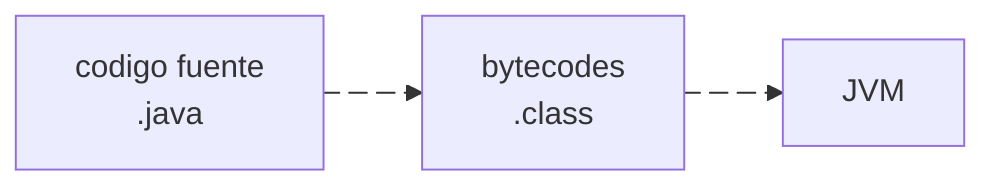
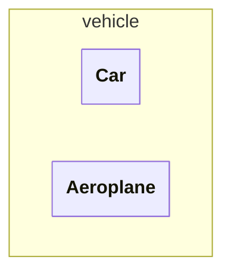
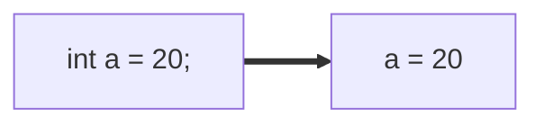
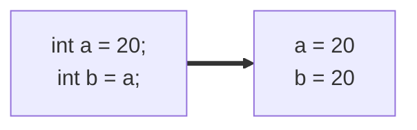

# JAVA - Curso práctico de formación (IZO-808)
Este archivo contiene notas sobre el libro **JAVA - Curso práctico de formación 
para la preparacion del examen de certificacion Java SE Programmer I: IZO-808**
del autor **Antonio Martín Sierra**, editorial **Alfaomega**, ISBN **978-607-538-267-8**

- [JAVA - Curso práctico de formación (IZO-808)](#java---curso-práctico-de-formación-izo-808)
  - [1. Fundamenrtos de JAVA.](#1-fundamenrtos-de-java)
    - [1.1 Principales características](#11-principales-características)
    - [1.2 Ciclo de vida de un programa](#12-ciclo-de-vida-de-un-programa)
    - [1.3 Estructura de una clase](#13-estructura-de-una-clase)
      - [1.3.1 Empaquetado de una clase](#131-empaquetado-de-una-clase)
      - [1.3.2 Importacion de clases](#132-importacion-de-clases)
    - [1.4 El metodo main](#14-el-metodo-main)
    - [1.5 Compilación y ejecución de programas Java](#15-compilación-y-ejecución-de-programas-java)
      - [1.5.1 Compilación](#151-compilación)
      - [1.5.2 Ejecución](#152-ejecución)
  - [2. Tipos de datos](#2-tipos-de-datos)
    - [2.1 Variables](#21-variables)
      - [2.1.1 Declaracion de una variable](#211-declaracion-de-una-variable)
      - [2.1.2 Ambito de una variable](#212-ambito-de-una-variable)
      - [2.1.3 Inicializacion por defecto](#213-inicializacion-por-defecto)
    - [2.2 Tipos de datos](#22-tipos-de-datos)
    - [2.2.1 Tipos primitivos](#221-tipos-primitivos)
      - [2.2.1.1 Literales](#2211-literales)
    - [2.2.2 Tipos Objeto](#222-tipos-objeto)


## 1. Fundamenrtos de JAVA.
### 1.1 Principales características

- **Lenguaje orientado a objetos:** adquiere las caracteristicas de los lenguajes 
orientados a objetos (herencia, sobrecarga, sobrescritura, polimorfismo y encapsulacion)
- **Portabilidad:** gracias a la JVM, un programa en java puede compilarse una vez y 
ejecutarse en cualquier lugar, es decir, el resultado de la compilacion no es dependiente
a la plataforma
- **Encapsulamiento:** nos permite utilizar modificadores de acceso para controlar como 
desde donde se puede accesar a metodos y atributos.
- **Robusto y Seguro:** se ejecuta en un entorno controlado por la JVM. La cual gestiona 
de manera automatica la memoria evitando violaciones de acceso, e impide operaciones
dañinas sobre el equipo.

### 1.2 Ciclo de vida de un programa

Al ser un lenguaje orientado a objetos los programas en java se escriben en clases, estas 
clases se escriben en archivos .java (codigo fuente), al compilarlos se generá un archivo 
.class (bytecodes) por cada clase definida.
Los bytecodes son independientes de la plataforma, pueden ejecutarse en cualquier S.O. que
cuente con la JVM.



### 1.3 Estructura de una clase
El objetivo de una clase es definir el comportamiento de los objetos que la utilicen, es 
posible crear uno o muchos objetos a partir de una clase. El comportamiento de los 
objetos se implementa mediente atributos y metodos.
Podemos entender una clase como un molde, y a los objetos como instancias fisicas creadas
mediante este molde.

Una clase se define utilizando la palabra reservada `class` seguida de un nombre, y entre 
llaves el contenido de la clase.
Una clase puede contener:
- **atributos:** variables que almacenan propiedades de los objetos
- **constructores:** funciones para crear objetos de la clase
- **metodos:** funciones para implementar comportamientos del objeto

>[!NOTE]
>Un archivo .java puede varias clases, pero solo 1 debe utilizar
el modificador de acceso `public` y su nombre deve coincidir con el nombre del archivo .java

>[!CAUTION]
>Si un archivo .java contiene dos o mas clases con el modificador de acceso `public` se genera
un error de compilacion

Ejemplo de una clase
```java
public class Car{
    private String model;  //atributo
    
    public Car(){  //constructor

    }

    public void acelerar(){  //metodo

    }
}
```

Para crear objetos de una clase utilizamos la palabra `new`.
```java
Car car = new Car();
```

Para hacer uso de los metodos de una clase utilizamos el objeto y con operador punto (.)
podemos acceder a los metodos.
```java
car.acelerar();
```
---
#### 1.3.1 Empaquetado de una clase
Las clases se organizan en paquetes (directorios), cada paquete puede contener varios
archivos .class y subpaquetes.
El paquete se puede definir  utilizando la palabra `package <package-name>`, 
esta sentencia debe ir al princiipio del archivo .java, todas las clases definidas
en el archivo estaran en el mismo paquete

```java
package vehicle 

public class Car{

}

class Aeroplane{

}
```


---
#### 1.3.2 Importacion de clases
Para utilizar clases de otros paquete se deben importar dentro del archivo .java, para ello
utilizamos la sentencia `import`. Esta setencia debe ir despues de la setencia `package` y
antes de la definicion de la clase
Esta sentencia nos permite importar clases de las siguientes maneras:
- **Importar una clase:** `import java.util.ArrayList`
- **Importar todas las clases de un paquete:** `import java.util.*`
- **Importar atributos estaticos de una clase:** `import java.lang.Math.*`

---

>[!CAUTION]
>La sentencia `package` debe ser la primera del archivo .java, si se invierte el orden entre 
`package` e `import` se producira un error de compilacion

---

### 1.4 El metodo main
Un programa en Java puede estar conformado por muchas clases, entre todas ellas debe 
existir una que contenga el metodo main. Este metodo es el punto de entrada, es utilizado por la JVM cuando se ejecuta la clase.

El metodo main solo admite dos formatos
```java
public static void main(String[] args){
    ...
}

public static void main(String arg1, String arg2, ..., String argN){
    ...
}
```

>[!CAUTION]
>Si el metodo main tiene un formato incorrecto **no se provocara un error de compilacion**
ya que sintacticamente son correctos, sin emabrgo, al ejecutar la clase se producira un 
error de ejecucion ya que la JVM no encontrara el metodo main

### 1.5 Compilación y ejecución de programas Java
Para poder compilar y ejecutar programas Java es necesario contar con el JDK.
El JDK (Java Development Kit) proporciona herramientas para realizar estas tareas,
asi como clases que conforman el Java Standar Edition (Java SE).

Para descargar alguna version del JDK se puede hacer en el siguienete enlace:
[https://www.oracle.com/java/technologies/downloads/](https://www.oracle.com/java/technologies/downloads/)

#### 1.5.1 Compilación
Para compilar un archivo .java debemos ejecutar por linea de comandos el comando: 
`javac FileName.java`

Si las clases que utilizamos estan definidas en paqutes y queremos que se genere
la estructura de carpetas, debemos usar: `javac -d . FileName.java`

>[!IMPORTANT]
> Si el codigo fuente tiene errores de compilacion, estos se mostraran en consola

#### 1.5.2 Ejecución
La ejecucion consiste en ejecutar la clase que contiene el metodo main, para ello
utilizamos el comando `java ClassName`

Si la clase se encuentra dentro de un paquete, se debe utilizar el nombre cualificado
de la clase `java package.ClassName` 

>[!IMPORTANT]
>Al momento de ejecutar una clase se indica el nombre de la misma, no el archivo 
.class que la contine


## 2. Tipos de datos

### 2.1 Variables
En java, los datos se manejan mediante variables independientemente de su tipo.
Una variables es una seccion de memoria a la cual le asiganamos un identificador y en la
que se alamcenan los datos del programa.

#### 2.1.1 Declaracion de una variable
Declarar una variable consiste en definir el tipo e indentificador de la misma.
la sintaxis que debemos seguir es `tipo identificador;`, por ejemplo, `int edad;`.

>[!IMPORTANT]
>En Java es necesario declarar una variable antes de poder usarla.

Para asignar un valor a una variable podemos seguir la sintaxis `identificador = valor;`, 
siguiendo con el ejemplo anterior seria de la siguiente manera `edad = 18;`.

Existen otras maneras de declarar variables:
- **Declarar y asignar valor en una sola instruccion:** `int a = 1;`
- **Declarar multiples variables en una sola linea:** `int b, c, d=8;`

 >[!IMPORTANT]
>El identificador de una variable debe cumplir con las siguientes reglas:
> - Se permite cualquier combinacion de letras, números y los símbolos $ y _
> - No se permite utilizar palabras reservadad de Java
> - No puede comenzar con un carácter numerico.
>
> Si alguna de estas reglas no se cumple se generara un error de compilacion

#### 2.1.2 Ambito de una variable
El ambito de una variable se refiere a la visibilidad de la misma, esto esta determinado por
el lugar donde se declara. Tenemos dos tipos de ambitos:
- **Atributo:** declaracion a nivel de clase, son compartidad por todos los metodos
- **Local:** declaracion a nivel de metodo, solo es visible en el metodo que la declara

>[!NOTE]
>En Java una variable local puede tener el mismo nombre que una variable atributo, en este caso,
>para utilizar la variable atributo hacemos uso de `this`

>[!NOTE]
>Si una variable es declara dentro de bloque de codigo como un if, for, while o algun otro
>Solo sera visible dentro de ese bloque.

Ejemplos:
```java
public class TestClass{
    int x;

    public void testMethod(){
        int x = 10;  //variable local
        this.x = x + 3  //variable atributo
    }
}
```

```java
public class TestClass{
    int x;

    public void testMethod(){
        int x = 10;  
        if(x > 5){
            int y = 5; //solo es visible dentro del if
            this.x = x + y + 3;
        }
    }
}
```

#### 2.1.3 Inicializacion por defecto
La inicializacion por defecto depende del ambito de la variable.
- **variable local:** no se inicializan por defecto, por lo que no puede usarse sin asiganrle antes un valor explicito
- **variable atributo:** se inicializan por defecto al momento de declararse, el valor de inicializacion depende del tipo de la variable.
  
| Tipo    | Valor por defecto |
| ------- | ----------------- |
| entero  | 0                 |
| decimal | 0.0               |
| boolean | false             |
| char    | '\u0000'          |
| object  | null              |

### 2.2 Tipos de datos 
En Java existen dos grupos de tipos de datos **tipos primitivos** y **tipo objetos**. 
Estos tipos son tratados internamente de forma distinta.

### 2.2.1 Tipos primitivos
Los tipos de datos primitivos representan a los tipos basicos del lenguaje. Se cuenta
con 8 tipos primitivos, los cuales se muestran en la siguiente tabla:

| Tipo    | Valores                   |
| ------- | ------------------------- |
| boolean | true o false              |
| byte    | entero de 8 bits          |
| short   | entero de 16 bits         |
| int     | entero de 32 bits         |
| long    | entero de 64 bits         |
| float   | decimal de 32 bits        |
| double  | decimal de 64 bits        |
| char    | codigo unicode de 16 bits |

<details open>

<summary>2.2.1.1 Literales</summary>

#### 2.2.1.1 Literales
A un dato especifico de un tipo primitivo se le conoce tambien como **literal**.
Los literales se pueden asignarse directamente a la variable del tipo que representan.

>[!NOTE]
>Los literales, segun el dato, se consideran de un tipo especifico
> - literal enteros, se consideran int `int n = 30`
> - literal decimal, se consideran double `double d = 3.6`
> - Para que un lteral decimal se considere float, se debe especificar con un f al final `float f = 3.6f`
> - literal char (entre comillas simples), se cosideran char `char c = '@'`
> - literal boolean, solo se consideran a los valores true o false `boolean b = true`

Los literales de tipo entero pueden ser representados en 4 sistemas de numeracion

- **decimal:** es el mas utilizado `int a = 250;`
- **octal:** se debe utilizar un 0 antes del numero `int o = 0432;`
- **hexadecimal:** se debe utilizar 0x antes del numero `int h = 0xef34;`
- **binario:** se debe usar 0b antes del numero `int b = 0b1001;`

Adicional, desde la version 7 de Java, es posible utilizar el simbolo "_" para 
representar literales numericas. Este simbolo facilita la interpretacion visual del programador
pero debe cumplir con las siguinetes restricciones:

- Debe aparecer entre digitos
- No se puede utilizar al principio o al final de la cifra
- No se puede utilizar junto al punto decimal

Algunos ejemplos de su uso son:
```java
int n = _345 //error
int s = 0x_B1 //error
int a = 1_000_000 //correcto
double b = 37.30_49 //correcto 
```

</details>

-------

Al declarar y asignar valor a un tipo primitivo, internamente la variable almacena el dato
en si.



Si en una siguiente instruccion asignamos esta variable a otra, se genera una copia del dato



### 2.2.2 Tipos Objeto