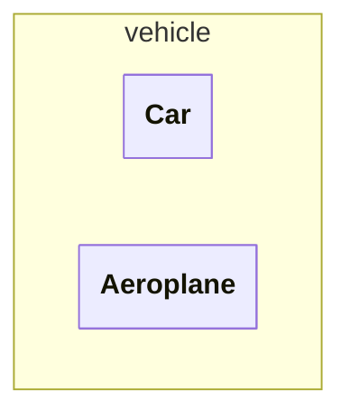

# JAVA - Curso práctico de formación (IZO-808)
Este archivo contiene notas sobre el libro **JAVA - Curso práctico de formación 
para la preparacion del examen de certificacion Java SE Programmer I: IZO-808**
del autor **Antonio Martín Sierra**, editorial **Alfaomega**, ISBN **978-607-538-267-8**

## 1. Fundamenrtos de JAVA.
### 1.1 Principales características

- **Lenguaje orientado a objetos:** adquiere las caracteristicas de los lenguajes 
orientados a objetos (herencia, sobrecarga, sobrescritura, polimorfismo y encapsulacion)
- **Portabilidad:** gracias a la JVM, un programa en java puede compilarse una vez y 
ejecutarse en cualquier lugar, es decir, el resultado de la compilacion no es dependiente
a la plataforma
- **Encapsulamiento:** nos permite utilizar modificadores de acceso para controlar como 
desde donde se puede accesar a metodos y atributos.
- **Robusto y Seguro:** se ejecuta en un entorno controlado por la JVM. La cual gestiona 
de manera automatica la memoria evitando violaciones de acceso, e impide operaciones
dañinas sobre el equipo.

### 1.2 Ciclo de vida de un programa

Al ser un lenguaje orientado a objetos los programas en java se escriben en clases, estas 
clases se escriben en archivos .java (codigo fuente), al compilarlos se generá un archivo 
.class (bytecodes) por cada clase definida.
Los bytecodes son independientes de la plataforma, pueden ejecutarse en cualquier S.O. que
cuente con la JVM.


### 1.3 Estructura de una clase
El objetivo de una clase es definir el comportamiento de los objetos que la utilicen, es 
posible crear uno o muchos objetos a partir de una clase. El comportamiento de los 
objetos se implementa mediente atributos y metodos.
Podemos entender una clase como un molde, y a los objetos como instancias fisicas creadas
mediante este molde.

Una clase se define utilizando la palabra reservada `class` seguida de un nombre, y entre 
llaves el contenido de la clase.
Una clase puede contener:
- **atributos:** variables que almacenan propiedades de los objetos
- **constructores:** funciones para crear objetos de la clase
- **metodos:** funciones para implementar comportamientos del objeto

>[!NOTE]
>Un archivo .java puede varias clases, pero solo 1 debe utilizar
el modificador de acceso `public` y su nombre deve coincidir con el nombre del archivo .java

>[!CAUTION]
>Si un archivo .java contiene dos o mas clases con el modificador de acceso `public` se genera
un error de compilacion

Ejemplo de una clase
```java
public class Car{
    private String model;  //atributo
    
    public Car(){  //constructor

    }

    public void acelerar(){  //metodo

    }
}
```

Para crear objetos de una clase utilizamos la palabra `new`.
```java
Car car = new Car();
```

Para hacer uso de los metodos de una clase utilizamos el objeto y con operador punto (.)
podemos acceder a los metodos.
```java
car.acelerar();
```
---
#### 1.3.1 Empaquetado de una clase
Las clases se organizan en paquetes (directorios), cada paquete puede contener varios
archivos .class y subpaquetes.
El paquete se puede definir  utilizando la palabra `package <package-name>`, 
esta sentencia debe ir al princiipio del archivo .java, todas las clases definidas
en el archivo estaran en el mismo paquete

```java
package vehicle 

public class Car{

}

class Aeroplane{

}
```


---
#### 1.3.2 Importacion de clases
Para utilizar clases de otros paquete se deben importar dentro del archivo .java, para ello
utilizamos la sentencia `import`. Esta setencia debe ir despues de la setencia `package` y
antes de la definicion de la clase
Esta sentencia nos permite importar clases de las siguientes maneras:
- **Importar una clase:** `import java.util.ArrayList`
- **Importar todas las clases de un paquete:** `import java.util.*`
- **Importar atributos estaticos de una clase:** `import java.lang.Math.*`

---

>[!CAUTION]
>La sentencia `package` debe ser la primera del archivo .java, si se invierte el orden entre 
`package` e `import` se producira un error de compilacion

---