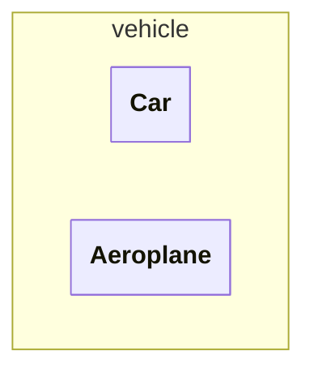
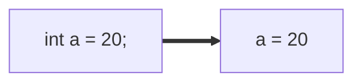
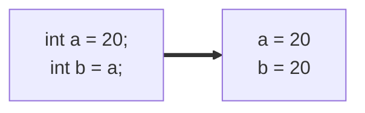
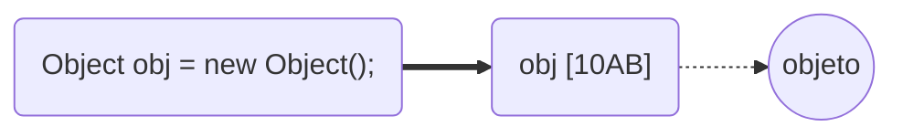
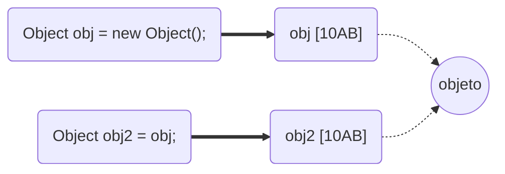
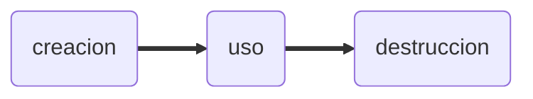

# JAVA - Curso práctico de formación (IZO-808)
Este archivo contiene notas sobre el libro **JAVA - Curso práctico de formación 
para la preparacion del examen de certificacion Java SE Programmer I: IZO-808**
del autor **Antonio Martín Sierra**, editorial **Alfaomega**, ISBN **978-607-538-267-8**

- [JAVA - Curso práctico de formación (IZO-808)](#java---curso-práctico-de-formación-izo-808)
  - [1. Fundamenrtos de JAVA.](#1-fundamenrtos-de-java)
    - [1.1 Principales características](#11-principales-características)
    - [1.2 Ciclo de vida de un programa](#12-ciclo-de-vida-de-un-programa)
    - [1.3 Estructura de una clase](#13-estructura-de-una-clase)
      - [1.3.1 Empaquetado de una clase](#131-empaquetado-de-una-clase)
      - [1.3.2 Importacion de clases](#132-importacion-de-clases)
    - [1.4 El metodo main](#14-el-metodo-main)
    - [1.5 Compilación y ejecución de programas Java](#15-compilación-y-ejecución-de-programas-java)
      - [1.5.1 Compilación](#151-compilación)
      - [1.5.2 Ejecución](#152-ejecución)
  - [2. Tipos de datos](#2-tipos-de-datos)
    - [2.1 Variables](#21-variables)
      - [2.1.1 Declaracion de una variable](#211-declaracion-de-una-variable)
      - [2.1.2 Ambito de una variable](#212-ambito-de-una-variable)
      - [2.1.3 Inicializacion por defecto](#213-inicializacion-por-defecto)
    - [2.2 Tipos de datos](#22-tipos-de-datos)
      - [2.2.1 Tipos primitivos](#221-tipos-primitivos)
        - [Literales](#literales)
        - [Conversion de tipos](#conversion-de-tipos)
      - [2.2.2 Tipos Objeto](#222-tipos-objeto)
        - [Ciclo de vida de los objetos](#ciclo-de-vida-de-los-objetos)
          - [Creacion](#creacion)
          - [Destruccion](#destruccion)
        - [Clases de envoltorio](#clases-de-envoltorio)
          - [Autoboxing/Unboxing](#autoboxingunboxing)
          - [Inmutabilidad de objetos envoltorio](#inmutabilidad-de-objetos-envoltorio)
  - [3. Operadores y estructuras de decision](#3-operadores-y-estructuras-de-decision)
    - [3.1 Operadores aritméticos](#31-operadores-aritméticos)
      - [3.1.1 Operadores simples.](#311-operadores-simples)
      - [3.1.2 Operadores de incremento y decremento](#312-operadores-de-incremento-y-decremento)
    - [3.2 Operadores de asignacion](#32-operadores-de-asignacion)
    - [3.3 Operadores condicionales](#33-operadores-condicionales)
    - [3.4 Operadores logicos](#34-operadores-logicos)


## 1. Fundamenrtos de JAVA.
### 1.1 Principales características

- **Lenguaje orientado a objetos:** adquiere las caracteristicas de los lenguajes 
orientados a objetos (herencia, sobrecarga, sobrescritura, polimorfismo y encapsulacion)
- **Portabilidad:** gracias a la JVM, un programa en java puede compilarse una vez y 
ejecutarse en cualquier lugar, es decir, el resultado de la compilacion no es dependiente
a la plataforma
- **Encapsulamiento:** nos permite utilizar modificadores de acceso para controlar como 
desde donde se puede accesar a metodos y atributos.
- **Robusto y Seguro:** se ejecuta en un entorno controlado por la JVM. La cual gestiona 
de manera automatica la memoria evitando violaciones de acceso, e impide operaciones
dañinas sobre el equipo.

### 1.2 Ciclo de vida de un programa

Al ser un lenguaje orientado a objetos los programas en java se escriben en clases, estas 
clases se escriben en archivos .java (codigo fuente), al compilarlos se generá un archivo 
.class (bytecodes) por cada clase definida.
Los bytecodes son independientes de la plataforma, pueden ejecutarse en cualquier S.O. que
cuente con la JVM.


### 1.3 Estructura de una clase
El objetivo de una clase es definir el comportamiento de los objetos que la utilicen, es 
posible crear uno o muchos objetos a partir de una clase. El comportamiento de los 
objetos se implementa mediente atributos y metodos.
Podemos entender una clase como un molde, y a los objetos como instancias fisicas creadas
mediante este molde.

Una clase se define utilizando la palabra reservada `class` seguida de un nombre, y entre 
llaves el contenido de la clase.
Una clase puede contener:
- **atributos:** variables que almacenan propiedades de los objetos
- **constructores:** funciones para crear objetos de la clase
- **metodos:** funciones para implementar comportamientos del objeto

>[!NOTE]
>Un archivo .java puede varias clases, pero solo 1 debe utilizar
el modificador de acceso `public` y su nombre deve coincidir con el nombre del archivo .java

>[!CAUTION]
>Si un archivo .java contiene dos o mas clases con el modificador de acceso `public` se genera
un error de compilacion

Ejemplo de una clase
```java
public class Car{
    private String model;  //atributo
    
    public Car(){  //constructor

    }

    public void acelerar(){  //metodo

    }
}
```

Para crear objetos de una clase utilizamos la palabra `new`.
```java
Car car = new Car();
```

Para hacer uso de los metodos de una clase utilizamos el objeto y con operador punto (.)
podemos acceder a los metodos.
```java
car.acelerar();
```
---
#### 1.3.1 Empaquetado de una clase
Las clases se organizan en paquetes (directorios), cada paquete puede contener varios
archivos .class y subpaquetes.
El paquete se puede definir  utilizando la palabra `package <package-name>`, 
esta sentencia debe ir al princiipio del archivo .java, todas las clases definidas
en el archivo estaran en el mismo paquete

```java
package vehicle 

public class Car{

}

class Aeroplane{

}
```


---
#### 1.3.2 Importacion de clases
Para utilizar clases de otros paquete se deben importar dentro del archivo .java, para ello
utilizamos la sentencia `import`. Esta setencia debe ir despues de la setencia `package` y
antes de la definicion de la clase
Esta sentencia nos permite importar clases de las siguientes maneras:
- **Importar una clase:** `import java.util.ArrayList`
- **Importar todas las clases de un paquete:** `import java.util.*`
- **Importar atributos estaticos de una clase:** `import java.lang.Math.*`

---

>[!CAUTION]
>La sentencia `package` debe ser la primera del archivo .java, si se invierte el orden entre 
`package` e `import` se producira un error de compilacion

---

### 1.4 El metodo main
Un programa en Java puede estar conformado por muchas clases, entre todas ellas debe 
existir una que contenga el metodo main. Este metodo es el punto de entrada, es utilizado por la JVM cuando se ejecuta la clase.

El metodo main solo admite dos formatos
```java
public static void main(String[] args){
    ...
}

public static void main(String arg1, String arg2, ..., String argN){
    ...
}
```

>[!CAUTION]
>Si el metodo main tiene un formato incorrecto **no se provocara un error de compilacion**
ya que sintacticamente son correctos, sin emabrgo, al ejecutar la clase se producira un 
error de ejecucion ya que la JVM no encontrara el metodo main

### 1.5 Compilación y ejecución de programas Java
Para poder compilar y ejecutar programas Java es necesario contar con el JDK.
El JDK (Java Development Kit) proporciona herramientas para realizar estas tareas,
asi como clases que conforman el Java Standar Edition (Java SE).

Para descargar alguna version del JDK se puede hacer en el siguienete enlace:
[https://www.oracle.com/java/technologies/downloads/](https://www.oracle.com/java/technologies/downloads/)

#### 1.5.1 Compilación
Para compilar un archivo .java debemos ejecutar por linea de comandos el comando: 
`javac FileName.java`

Si las clases que utilizamos estan definidas en paqutes y queremos que se genere
la estructura de carpetas, debemos usar: `javac -d . FileName.java`

>[!IMPORTANT]
> Si el codigo fuente tiene errores de compilacion, estos se mostraran en consola

#### 1.5.2 Ejecución
La ejecucion consiste en ejecutar la clase que contiene el metodo main, para ello
utilizamos el comando `java ClassName`

Si la clase se encuentra dentro de un paquete, se debe utilizar el nombre cualificado
de la clase `java package.ClassName` 

>[!IMPORTANT]
>Al momento de ejecutar una clase se indica el nombre de la misma, no el archivo 
.class que la contine


## 2. Tipos de datos

### 2.1 Variables
En java, los datos se manejan mediante variables independientemente de su tipo.
Una variables es una seccion de memoria a la cual le asiganamos un identificador y en la
que se alamcenan los datos del programa.

#### 2.1.1 Declaracion de una variable
Declarar una variable consiste en definir el tipo e indentificador de la misma.
la sintaxis que debemos seguir es `tipo identificador;`, por ejemplo, `int edad;`.

>[!IMPORTANT]
>En Java es necesario declarar una variable antes de poder usarla.

Para asignar un valor a una variable podemos seguir la sintaxis `identificador = valor;`, 
siguiendo con el ejemplo anterior seria de la siguiente manera `edad = 18;`.

Existen otras maneras de declarar variables:
- **Declarar y asignar valor en una sola instruccion:** `int a = 1;`
- **Declarar multiples variables en una sola linea:** `int b, c, d=8;`

 >[!IMPORTANT]
>El identificador de una variable debe cumplir con las siguientes reglas:
> - Se permite cualquier combinacion de letras, números y los símbolos $ y _
> - No se permite utilizar palabras reservadad de Java
> - No puede comenzar con un carácter numerico.
>
> Si alguna de estas reglas no se cumple se generara un error de compilacion

#### 2.1.2 Ambito de una variable
El ambito de una variable se refiere a la visibilidad de la misma, esto esta determinado por
el lugar donde se declara. Tenemos dos tipos de ambitos:
- **Atributo:** declaracion a nivel de clase, son compartidad por todos los metodos
- **Local:** declaracion a nivel de metodo, solo es visible en el metodo que la declara

>[!NOTE]
>En Java una variable local puede tener el mismo nombre que una variable atributo, en este caso,
>para utilizar la variable atributo hacemos uso de `this`

>[!NOTE]
>Si una variable es declara dentro de bloque de codigo como un if, for, while o algun otro
>Solo sera visible dentro de ese bloque.

Ejemplos:
```java
public class TestClass{
    int x;

    public void testMethod(){
        int x = 10;  //variable local
        this.x = x + 3  //variable atributo
    }
}
```

```java
public class TestClass{
    int x;

    public void testMethod(){
        int x = 10;  
        if(x > 5){
            int y = 5; //solo es visible dentro del if
            this.x = x + y + 3;
        }
    }
}
```

#### 2.1.3 Inicializacion por defecto
La inicializacion por defecto depende del ambito de la variable.
- **variable local:** no se inicializan por defecto, por lo que no puede usarse sin asiganrle antes un valor explicito
- **variable atributo:** se inicializan por defecto al momento de declararse, el valor de inicializacion depende del tipo de la variable.
  
| Tipo    | Valor por defecto |
| ------- | ----------------- |
| entero  | 0                 |
| decimal | 0.0               |
| boolean | false             |
| char    | '\u0000'          |
| object  | null              |

### 2.2 Tipos de datos 
En Java existen dos grupos de tipos de datos **tipos primitivos** y **tipo objetos**. 
Estos tipos son tratados internamente de forma distinta.

#### 2.2.1 Tipos primitivos

Los tipos de datos primitivos representan a los tipos basicos del lenguaje. Al declarar y asignar 
valor a un tipo primitivo, internamente la variable almacena el datoen si.



Si en una siguiente instruccion asignamos esta variable a otra, se genera una copia del dato



Se cuenta con 8 tipos primitivos, los cuales se muestran en la siguiente tabla:

| Tipo    | Valores                   |
| ------- | ------------------------- |
| boolean | true o false              |
| byte    | entero de 8 bits          |
| short   | entero de 16 bits         |
| int     | entero de 32 bits         |
| long    | entero de 64 bits         |
| float   | decimal de 32 bits        |
| double  | decimal de 64 bits        |
| char    | codigo unicode de 16 bits |

##### Literales
A un dato especifico de un tipo primitivo se le conoce tambien como **literal**.
Los literales se pueden asignarse directamente a la variable del tipo que representan.

>[!NOTE]
>Los literales, segun el dato, se consideran de un tipo especifico
> - literal enteros, se consideran int `int n = 30`
> - literal decimal, se consideran double `double d = 3.6`
> - Para que un lteral decimal se considere float, se debe especificar con un f al final `float f = 3.6f`
> - literal char (entre comillas simples), se cosideran char `char c = '@'`
> - literal boolean, solo se consideran a los valores true o false `boolean b = true`

Los literales de tipo entero pueden ser representados en 4 sistemas de numeracion

- **decimal:** es el mas utilizado `int a = 250;`
- **octal:** se debe utilizar un 0 antes del numero `int o = 0432;`
- **hexadecimal:** se debe utilizar 0x antes del numero `int h = 0xef34;`
- **binario:** se debe usar 0b antes del numero `int b = 0b1001;`

Adicional, desde la version 7 de Java, es posible utilizar el simbolo "_" para 
representar literales numericas. Este simbolo facilita la interpretacion visual del programador
pero debe cumplir con las siguinetes restricciones:

- Debe aparecer entre digitos
- No se puede utilizar al principio o al final de la cifra
- No se puede utilizar junto al punto decimal

Algunos ejemplos de su uso son:
```java
int n = _345 //error
int s = 0x_B1 //error
int a = 1_000_000 //correcto
double b = 37.30_49 //correcto 
```

##### Conversion de tipos
Todos los datos primitivos pueden ser convertidos a otro tipo de dato, excepto los booleanos.
Las conversiones de datos pueden ser de dos tipos:

- **Implícitas:** Java convierte de forma automatica el dato origen al tipo de dato destino.
Es posible utilizar esta conversion siempre que el tipo de dato origen sea de menor o igual 
tamaño que el destino

>[!CAUTION]
>No se podra realizar una conversion implícita cuando:
> - El tipo origen sea numerico y el destino sea char
> - El tipo origen sea decimal y el destino sea entero


#### 2.2.2 Tipos Objeto
Cualquier clase Java es de tipo objeto, se utilizan mediente variables pero internamente se 
manejan de forma distinta. Cuando se crear una variable de tipo objeto, esta almacena una
referencia hacia la zona de memoria donde se encuentra el objeto.



Este tipo de manejo implica que si en algun momento una variable se asigna a otra, tendremos
dos variables con la misma referencia al objeto.



Los objetos no adminten las mismas operaciones que los tipos primitivos (aritmeticas, logicas, etc.).
En cambio existen metodos que pueden ser utilizados en el flujo del programa para realizar
alguna accion.
El uso de estos metodos se realiza mediante la varible, el operador punto y el nombre del metodo
```java
Car car = new Car();
car.turnOn();
```

##### Ciclo de vida de los objetos



###### Creacion
Para crear una instancia de una clase se utiliza el operador `new` seguido del nombre de la clase
Esta instruccion crea un objeto nuevo en memoria y devuelve una referencia a este objeto para
almacenarla en la variable.

```java
Object obj = new Object();
String s = new String("hola");
```

En esta etapa se utilizan los constructores de una clase, estos se ejecutan durante 
la creacion de un objeto. 
Los constructores se definen dentro de la clase como un metodo con el mismo nombre de la clase.

```java
public class TestClass{
  public TestClass(){
    ...
  }
}
```

El codigo definido en el constructor se ejecutara cada vez que se cree un objeto de la clase, el objetivo
de estos metodos es realizar alguna inicializacion de los atributos de la clase por lo que pueden
recibir parametros.
Una clase puede contener varios constructores, pero deben diferenciarse por el numero y/o tipos
de parametros que reciben

```java
public class TestClass{
  public TestClass(){
    ...
  }

  public TestClass(int i){
    ...
  }

  public TestClass(String s){
    ...
  }
}
```

###### Destruccion
La destruccion de un objeto y la liberacion de la memoria ocupada por el mismo es realizado
por un proceso del **Garbage Collector (GC)**.
Cuando este proceso se ejecute se liberara la memoria de todos los objetos que hayan sido marcados
para recoleccion.

>[!NOTE]
>Un objeto es marcado para recoleccion en el momento en que no hay ninguna variable apuntando a el.


```java

public static void main(String[] args){
  Object o1 = new Object();
  Object o2 = new Object();
  o1 = o2;  //el primer objeto es marcado para recoleccion
  o2 = null; //el segundo objeto es marcado para recoleccion
}

```

>[!NOTE]
>Cuando un objeto es marcado para recoleccion no hay forma de recuperarlo.

Todas las clases cuentan con un metodo `finalize()`, este metodo es usado por la JVM
justo antes de ser eliminado de memoria. `finalize()` puede ser llamado una vez o ninguna, pero
nunca mas de una vez

>[!NOTE]
>Puede darse el caso de que un objeto nunca sea eliminado, y esto puede deberse a que nunca
>sea marcado para recoleccion, o porque el Garbage Collector no se haya activado desde que 
>el objeto se marco para recoleccion.

##### Clases de envoltorio
El paquete `java.lang` cuenta con un grupo de clases que permiten datos primitivos
en objetos. Para cada tipo primitivo existe una clase envoltorio.

| Tipo    | Clase envoltorio |
| ------- | ---------------- |
| boolean | Boolean          |
| byte    | Byte             |
| short   | Short            |
| int     | Integer          |
| long    | Long             |
| float   | Float            |
| double  | Double           |
| char    | character        |

Todas estas clases disponen de un constructor que recibe como parametro el tipo primitivo
```java
Integer i = new Integer(40);
Character c = new Character('#');
```

A excepcion de Character, todas las clases cuentan con un constructor que recibe 
como parametro la representacion del tipo primitivo en forma de texto.
```java
Integer i = new Integer("79");
Boolean b =  new Boolean("false");
```

Adicionalmente, cada una de estas clases cuenta con un metodo para recuperar el 
valor primitivo. Este metodo sigue la nomeclatura `<primitive-type>Value()`
```java
char c2 = c.charValue();
int i2 = i.intValue();
```

###### Autoboxing/Unboxing
Desde Java 5, es posible crear objetos de las clases envoltorio asignando directamente
una literal (sin hacer uso de `new`), a esto se le conoce como **Autoboxing**
```java
Integer in = 89;
Boolean bo = false;
```

Tambien es posible recuperar el tipo primitivo asignando el objeto envoltorio a una 
variable de tipo primitivo, esto es conocido como 
```java
int inp = in;
boolean bop = bo
```

###### Inmutabilidad de objetos envoltorio
Los objetos de clases envoltorio son inmutables, es decir, no se pueden modificar
La forma en la que funcionan en una operacion es la siguiente.
```java
Integer a = 10;    
a = a + 2;
```
En la primera linea se utiliza autoboxing para crear el objeto envoltorio.
En la segunda linea, para poder realizar la operacion se realizan los siguientes pasos:
1. Se utiliza unboxing para obtener el primitivo de `a`
2. Se genera un nuevo objeto (autoboxing) utilizando el resultado de la operacion

>[!TIP]
>Debido a la inmutabilidad, es mas eficiiente utilizar variables primitivas si vamos
>a realizar operaciones aritmeticas, ya que el proceso de autoboxing/unboxing puede
>representar un mayor consto de rendiemiento.


## 3. Operadores y estructuras de decision

### 3.1 Operadores aritméticos
Permiten realizar operaciones aritméticas con los datos de tipo numérico, incluye
los tipos primitivos y las clases envoltorio.

Los operadores aritmético son +,-,*,/,%,++,--.

#### 3.1.1 Operadores simples.
Los operadores simples son suma (+), resta (-), multiplicacion (*), division (/) y 
resto o modulo (%).

Si utilizamos estos operadores con numeros enteros, el resultado sera siempre int. 
Pero si alguno de los operandos es long, el resultado tambien sera long.

En el caso de trabajar con numero decimales, el resultado siempre sera del tipo mas grande, por ejemplo, al usar un long y un double el resultado seria double.

#### 3.1.2 Operadores de incremento y decremento
Se trata de operadores uniarios (se aplican sobre una variable) y solo son utilizables
con numeros enteros. 

Existen dos operadores incremento (++) y decremento (--)

Estos operadores realizan una conversion del resultado al tipo de la varible, por ejemplo, `a++` es equivalete a `a = (byte)(a+1)`

Otro aspecto importante de estos operadores es la posicion del operador, ya que pueden 
utilizarse antes o despues de la variable. Al utilizarse solo estos operadores la 
posicion es irrelevante ya que `a++` tiene el mismo efecto que `++a`, sin embargo, esto cambia cuando se utilizan mas operadores en la expresion

- **despues de la variable:** primero se usa el valor de la variable y despues se hace el incremento
- **antes de la variable:** primero se hace el incremento y despues se usa el valor de la variable

```java
int a = 5, b = 5;
int x = a++;
int y = ++b;
```

En el ejemplo anterior a y b terminarian con un valor de 6, sin embargo, x tendrian el valor 5 
mientras que y tendria el valor 6. 

### 3.2 Operadores de asignacion
Se emplean para asignar un valor a una variable, el operador mas comun es =, sin embargo existenten
tambien los operadores +=, -=, *=, /= y %=. Estos ultimos operadores permiten realizar una operacion
aritmetica utlizando el valor de una variable y asignando el resultado a la misma variables. Son unarios e incluyen un casting del resultado de la operacion al tipo de la variable. Por ejemplo
`a = a + 3` es equivalente `a += 3`

### 3.3 Operadores condicionales 
Son empleados para evaluar una condicion y dan como resultado un valor boolean, suelen ser usados en
instrucciones de control de flujo.

En este grupo se encuentran los operadores <, >, <=, >=, ==, !=. Solo pueden usarse con tipos
primitivos y compatibles entre si

>[!NOTE]
>El operador == puede usarse con objetos

### 3.4 Operadores logicos
Existen 3 operadores logicos and (&&), or (||) y not (!), estos realizan operaciones sobre tipos
boolean y dan como resultado un valor boolean.

>[!NOTE]
>Tanto && como || funcionan en modo cortocircuito, es decir, si la evaluacion del primer operando
determina el resultado de la operacion, el segundo operando no es evaluado.


