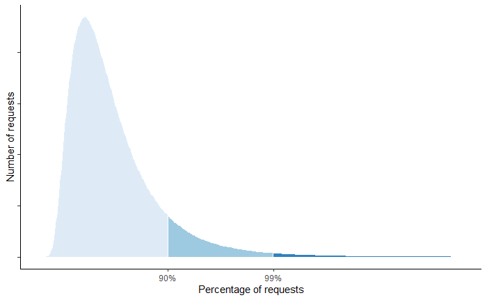
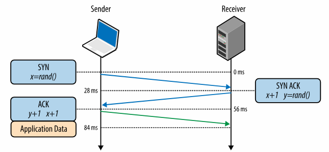
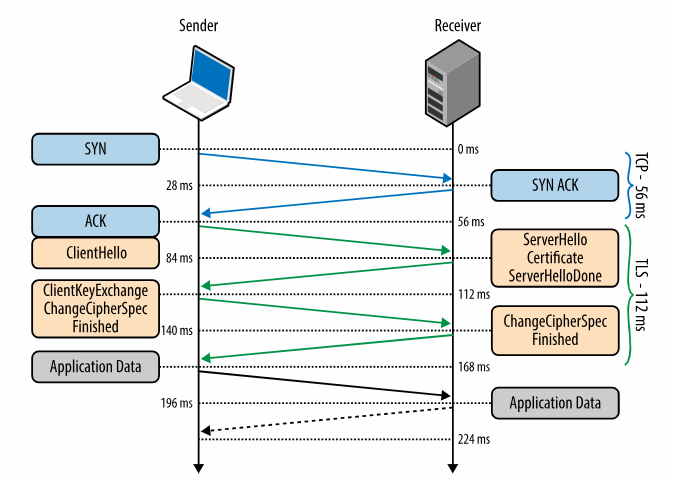

# Rendimiento
El perfomance (rendimiento) es la velocidad de respuesta de un sistema bajo una 
carga de trabajo y un hardware determinado. La medida del rendimiento se ve afectado
por dos variables:

- **Carga de trabajo:** contempla el volumen de peticiones, la cantidad de datos
almacenados, etc.

- **Hardware:** contempla el tipo, la capacidad, etc.

Al momento de medir el rendimiento estas dos variables deben mantenerse fijas ya que 
modificarlas puede afectar la medicion. Esto no quiere decir que el sistema no podra 
soportar una carga de trabajo distinta o un hardware diferente.

El objetivo es mantener el rendimiento estable cuando la carga de trabajo aumente, 
puede tener degradaciones leves pero estas nunca deben pasar a se graves.
Asi como detectar problemas en el rendimiento a causa del hardware, los
cuales deben disminuir o desaparecer cuando se aumente la capacidad o se mejore el hardware

## Problemas de rendimiento
Un problema de rendimiento es el resultado de una cola de procesos acumulados, esto
termina provocando bloqueos en diferentes componentes como red, base de datos, cpu,
entre otros.

Los acumulamientos de proceso pueden deberse a multiples factores, pero es posible
agruparlos en 3 categorias:

- **Procesamiento ineficiente:** sucede cuando se cuenta con un algoritmo o proceso 
que no es eficuente, provocando que las peticiones se atrasen al pasar por el.
  
- **Acceso a recursos en serie:** sucede cuando se utiliza unicamente un hilo para 
la ejecucion de procesos, provocando bloque de acceso a recursos.

- **Capacidad limitada de recursos:** sucede cuando los recursos de hardware tiene alguna 
limitacion, provocando que solo se pueda atender un numero determinado de peticiones a al vez

El trabajo de un arquitecto de software es:
En un sistema existente, identificar en donde se estan generando colas de procesos y 
hacer modificaciones para mejorar el rendimiento.
Al diseñar o crear un nuevo sistema, identificar en que puntos puede producirse una cola
e intentar evitarlas para evitar problemas de rendimiento.

## Principios del rendimiento
Para mejorar el rendimiento de un sistema debemos contemplar los siguinetes principios.

### **Eficiencia.** 
La eficiencia suele medirse en un contexto de peticiones lineales, es decir, solo una 
entra al sistema y no puede entrar otra hasta que esta salga. La eficiencia se ve 
afectada por diferentes areas.

- **Uso de recursos:** contempla la eficiencia en uso de recuros IO (memoria, red, disco, etc.), 
asi como la eficiencia del CPU. El objetivo es que los recursos se usen de la mejor manera. 

- **Logica:** contempla la eficiencia en la logica de los algoritmos utilizados en la 
programacion y de los queries en base de datos. El objetivo es escribirlos de tal forma 
que hagan el minimo trabajo posible y utilicen una cantidad minima de CPU y IO 
(suele delegarse a los desarrolladores)

- **Almacenamiento de datos:** contempla el almcenamiento de datos en estructuras y 
bases de datos. El objetivo es que las consultas se ejecuten de manera eficiente, 
esto implica seleccionar las estruturas correctas e indexar datos en DB.

- **Cache:** su implementacion requiere cambios minimos en codigo y ofrece un gran 
beneficio en el tiempo de procesamiento

Si estas areas son manejadas de forma correcta, se asegurara que los tiempos de 
respuesta en un contexto de solicitudes lineales baje drasticamente.

### **Concurrencia**
La concurrencia consiste en el manejo de multiples peticiones al mismo tiempo, estas 
se ejecutan en paralelo pero cada una de ellas tiene un proceso independiente. Al 
manejar correctamente los puntos de la eficiencia nos aseguramos de que la ejecucion 
de cada proceso sea eficiente.

Para lograr la concurencia se necesita del hardware y el software, ya que ambos deben 
permitir el procesamiento de multiples peticiones. Del lado del software se deben 
considerar dos concpetos **colas** y **coherencia** esto debido a que al trabajar 
en un mismo hardware, las peticiones se pueden retrasar por bloqueos de recursos

### **Capacidad**
La capacidad esta relacionada con los recursos de hardware (CPU, memoria, disco, red, etc.), 
esto es algo que no suele tratarse o manejarse en el diseño de sistemas, por lo que se 
suele mantener un valor fijo haciendo que la eficiencia dependa unicamente de los 
puntos anteriores.

## Objetivos de rendimiento
Los objetivos de rendimiento en un sistema son dos:

- **Minimizar latencia**
- **Maximizar rendimeinto**

### Minimizar latencia
La latencia es el tiempo que transcurre entre la recepcion de una solicitud y el envio
de una respuesta. Esta medida suma el tiempo de espera y el tiempo de procesamiento, 
por lo que el objetivo es reducir estos dos tiempos.

### Maximizar rendimiento
El rendimiento es la tasa de solicitudes que un sistema puede manejar en un tiempo
determinado. Esta medida depende directamente de la **latencia** y la **capacidad**

>[!NOTE]
>El trabajo de un arquitecto de software es minimazar la latencia, ya que esto ayudara 
>a maximizar el rendimiento considerando que siempre tendremos la capacidad neceseria.

## Medidas de rendimeinto
Las medidas importantes que debemos conocer para determinar el rendimeinto de un 
sistema son:

- latencia: afecta la experiencia del usuario, el objetivo es que sea lo mas baja posible
  
- rendimiento: afecta el numero de solicitudes que se admiten, el objetivo es que sea lo mas
grande posible y como minimo que sea mayor al numero maximo de usuarios que se admitiran

- errores: se mide como porcentaje, indica si la solucion es funcional o no. Se permiten
errores de tiempo de espera o tiempo de procesamiento pero no deben ser errores en 
funcionalidades

- saturacion de recurso: nos indica la cantidad de recursos que se utilizan (cpu, red, etc.)
permite saber si es necesario hacer ajustes en hardware (disminuir o aumentar)

Otro aspecto importante es la latencia en cola de peticiones, esta se mide medinete un grafico
en el cual se representan el numero de peticiones (eje Y) y el tiempo de respuesta (eje X)

Permite indificar el tiempo de respuesta que se tiene a medida que aumentan las solicitudes.
Lo ideal es que la mayoria se encuentre con una latencia baja, de no ser asi nos indica
que hay problemas de latencia.

## Latencia en peticiones seriales
### Latencia de red
La latencia de red se puede separar en dos tipos de redes, internet e intranet.

internet: comunicacion entre el navegador y nuestro server.
Este tipo de comunicacion suelen ser de distancias largas e implican multiples redes de por medio, 
lo que puede generar que no sean tan rapidas

intranet: comunicacion entre servicios alojados dentro de una misma red.
Suelen ser comunicciones de distancias cortas ademas de ser conexiones muy fiables, esto hace
que las conexiones sean bastante rapidas.

Ambos tipos de redes pueden presentar latencia, sin emabrgo, las consideraciones son distintas
segun el tipo de red del que se trate

#### Transferencia de datos
Al momento de trasnferir datos se puede presentar latencia, y esta depende de la forma de 
conexion entre el punto A y B.

En una conexion cableada, los datos viajan a traves del cable por lo que la latencia es el tiempo
que los datos se tardan en llegar del punto A al punto B, y puede verse afectado por **distancia**,
**calidad del medio de conexion**, **congestion de red**, etc.

#### Creacion de conexiones
La creacion de conexiones (conexiones TCP) es otro punto donde se puede presentar latencia.
Cuando un cliente requiere comunicarse con un servidor, es necesario realizar una conexion TCP, 
la cual tiene los siguientes pasos:

Cada uno de los pasos requiere cierto tiempo para completarse, y este tiempo puede variar
dependiendo de factores como **distancia fisica**, **trafico de red**, **hardware de red**. etc.

Otro tipo de conexiones son SSL/TLS, suelen ocurrir cuando un cliente intenta comunicar con un
servidor mediante una red de internet, esta conexion se realiza con un socket seguro.
Este tipo de conexione estan por encima de una conexion TCP, es decir, el cliente debera
crear la conexion TCP y ademas debe realizar pasos extras para completar la conexion SSL o TLS

Estos pasos extras represenatan un tiempo adicional en la creacion de la conexion, ademas de que
tambien pueden verse afectado por diversos factores que impacten en el tiempo.

#### Manejo de la latencia de red

**Persistent Connections**  
Podemos reducir o evitar la latencia producida por la creacion de conexiones evitando crear una 
nueva conexion con un servidor o servicio cada vez que la utilicemos, para ello debemos asegurarnos
de que nuestro cliente implemente y utilice **persistent connections**. Esto nos permite crear
una conexion y reutilizarla n veces.

Los navegadores por defecto utilizan **persistent connections**, por lo que desde ese lado
no debemos preocuparnos por hacer un manejo por nuestra cuenta.

Cuando se trabaja con conexion a bases de datos, el concepto **persistent connections**
se aplica utilizando un pool de conexiones, con ello se crean algunas conexiones a DB las
cuales pueden ser reutilizadas 

**Transferencia de datos**
La transferencia de datos puede presentar latencia por diferentes factores, los siguientes 
puntos pueden ayudarnos a disminuirla.

- **Datos en cache o sesiones:** almacenar datos en cache o en sesiones nos permite reducir
o incluso evitar la trasnferencia de informacion en la red, es utili con datos que no
suelen cambiar con frecuencia.

Los navegadores tambien lo utilizan para alamcenar datos estaticos como imagenes, archivos 
javascript, archivos css, entre otros

- **Formato de datos y compresion:** es importnate determinar el formato de datos correctos
y por ende el protocolo de comunicacion adecuado para el sistema, esto nos da una mejora
en latencia pero puede reducir la interoperabilidad entre aplicaciones.

Otro aspecto que debemos aplicar en las respuesta es la compresion de datos, con el fin de
reducir el tamaño de los datos que se trasnfieren. Esto puede provocar una sobrecarga en la
compresion y descompresion de datos pero no suele ser tan costosa o significativa.

- **SSL session caching:** al utilizar conexiones SSL existen datos qie se intercambian 
entre el cliente y el servidor, estos pueden almacenarse en cache y eso permitiria 
tomar un atajo al momento de crear una conexion mejorando los tiempos en este proceso

